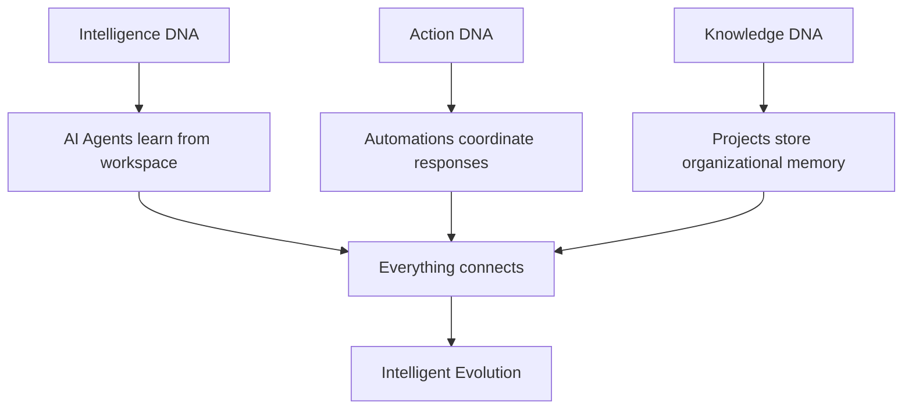
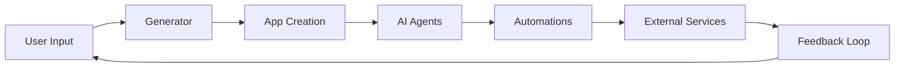

# Chapter 1: Getting Started with Taskade

Welcome to Taskade! If you're reading this, you're about to discover a revolutionary approach to productivity that combines AI intelligence with collaborative workflows. Taskade isn't just another task management app—it's a platform where your workspace becomes a living, intelligent organism.

## What Makes Taskade Revolutionary?

Taskade introduces the concept of **"Living DNA"** - an interconnected system where:
- 🤖 **AI Agents** become specialized team members
- ⚡ **Smart Automations** act as your business's nervous system
- 📊 **Projects** form your organizational memory
- 🔄 **Everything learns** from everything else

## Getting Started with Taskade

### Account Setup

```bash
# Visit Taskade
open https://taskade.com

# Sign up with your preferred method:
# - Google account
# - Email and password
# - SSO (for enterprise users)
```

### Your First Workspace

Once logged in, you'll see Taskade's unique interface:

```typescript
interface TaskadeWorkspace {
  homeSubspace: {
    generator: AIGenerator
    aiAgents: Agent[]
    automations: Automation[]
    projects: Project[]
  }
  subspaces: Subspace[]
}
```

### The Generator Input Field

At the top of every workspace, you'll find the **Generator Input Field** - this is where the magic happens:

```javascript
// Example of what you can type in the generator
const generatorExamples = [
  "Create a customer onboarding app with automated welcome emails",
  "Build an inventory tracker that reorders supplies automatically",
  "Design a project dashboard with real-time team metrics",
  "Make a meeting scheduler that finds optimal times for everyone"
]
```

## Understanding Taskade's Core Components

### 1. Home Subspace Intelligence

Every workspace starts with a **Home Subspace** containing:

```typescript
const homeSubspace = {
  generator: "AI-powered app builder",
  aiAgents: "Custom-trained assistants",
  automations: "100+ service integrations",
  projects: "Your data and workflows"
}
```

### 2. AI Agents

Taskade agents are specialized digital team members:

```javascript
const marketingAgent = {
  name: "MarketingAssistant",
  expertise: "Content creation and campaign management",
  tools: ["social_media", "analytics", "content_generation"],
  trainingData: "Your marketing projects and preferences"
}
```

### 3. Smart Automations

Automations connect your tools and data:

```javascript
const automationExample = {
  trigger: "New lead in CRM",
  conditions: [
    "Lead score > 70",
    "Budget > $5000"
  ],
  actions: [
    "Create project in Taskade",
    "Send welcome email",
    "Schedule discovery call"
  ]
}
```

## Your First AI Agent

Let's create your first AI agent:

### Step 1: Access Agent Panel

1. Open any workspace
2. Click the AI agent icon in the left panel
3. Select "Create New Agent"

### Step 2: Configure Your Agent

```javascript
const myFirstAgent = {
  name: "ProductivityAssistant",
  role: "Help manage daily tasks and boost productivity",
  personality: {
    helpfulness: 0.9,
    creativity: 0.7,
    thoroughness: 0.8
  },
  capabilities: [
    "task_organization",
    "time_management",
    "project_planning"
  ]
}
```

### Step 3: Train Your Agent

Give your agent context by:
- Sharing your typical workflows
- Describing your work style
- Providing examples of tasks you handle

## Building Your First Automation

### Simple Email Notification

```javascript
const emailAutomation = {
  name: "Task Completion Alerts",
  trigger: {
    type: "task_completed",
    project: "any"
  },
  action: {
    type: "send_email",
    to: "team@company.com",
    subject: "Task Completed: {{task.name}}",
    body: "Great work! {{task.assignee}} completed {{task.name}}"
  }
}
```

### Advanced Multi-Step Automation

```javascript
const complexAutomation = {
  name: "New Client Onboarding",
  trigger: {
    type: "form_submission",
    form: "client_intake"
  },
  steps: [
    {
      action: "create_project",
      template: "client_onboarding"
    },
    {
      action: "invite_team_members",
      roles: ["account_manager", "project_manager"]
    },
    {
      action: "schedule_meeting",
      type: "kickoff_call"
    },
    {
      action: "send_welcome_pack",
      via: "email"
    }
  ]
}
```

## The Living DNA Philosophy

Taskade's architecture is built on **Living DNA strands**:



### How Living DNA Works

1. **Intelligence DNA**: AI agents trained on your workspace patterns
2. **Action DNA**: Automations that respond to events and triggers
3. **Knowledge DNA**: Projects and data that form institutional memory
4. **Evolution DNA**: The system gets smarter with every interaction

## Creating Your First Complete App

Using the Genesis app builder:

### Step 1: Describe Your App

In the generator input field, type:
```
Create a project management dashboard that shows team progress, upcoming deadlines, and budget tracking
```

### Step 2: Genesis Builds Your App

Taskade automatically creates:
- Complete project management interface
- Real-time progress tracking
- Deadline notifications
- Budget monitoring widgets
- Team collaboration features

### Step 3: Customize and Extend

```javascript
const customizations = {
  addFeatures: [
    "Time tracking integration",
    "Resource allocation charts",
    "Risk assessment module"
  ],
  integrations: [
    "Google Calendar",
    "Slack notifications",
    "Jira sync"
  ]
}
```

## Understanding Taskade's Architecture

### Subspace Organization

```typescript
const workspaceStructure = {
  home: {
    type: "intelligence_hub",
    contains: ["generator", "ai_agents", "automations"]
  },
  projects: {
    type: "data_containers",
    purpose: "Store and organize information"
  },
  apps: {
    type: "generated_applications",
    source: "Built from generator or converted projects"
  }
}
```

### Data Flow Architecture



## What We've Accomplished

✅ **Set up Taskade account** and workspace
✅ **Understood Living DNA** architecture
✅ **Created your first AI agent**
✅ **Built basic automation workflows**
✅ **Generated your first app** using Genesis
✅ **Explored Taskade's core concepts**

## Next Steps

Now that you understand Taskade's fundamentals, let's dive deeper into the Living DNA architecture in [Chapter 2: Living DNA Architecture](02-living-dna-architecture.md).

---

**Ready to explore more?**
- Try creating different types of AI agents
- Experiment with various automation triggers
- Build more complex apps using the generator
- Explore the 100+ available integrations

*Remember: Taskade learns from your usage patterns, so the more you use it, the smarter it becomes!*
