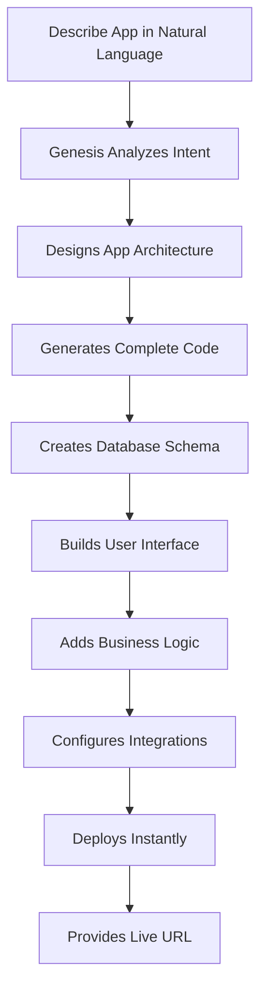

# Chapter 5: Genesis App Builder

Welcome to the most revolutionary feature in Taskade: **Genesis**, the AI-powered app builder that transforms your ideas into complete applications. Unlike traditional app builders that require coding expertise, Genesis understands natural language and builds production-ready applications from simple descriptions.

## Genesis Fundamentals

### How Genesis Works

```typescript
interface GenesisSystem {
  input: NaturalLanguageDescription
  understanding: ContextAnalysis
  architecture: AppArchitecture
  implementation: CodeGeneration
  deployment: InstantDeployment
  evolution: ContinuousImprovement
}
```

### The Genesis Process



## Building Your First Genesis App

### Step 1: Describe Your App

```javascript
const appDescription = `
Create a customer feedback management system that:
- Collects feedback through a simple web form
- Categorizes feedback automatically using AI
- Tracks response times and satisfaction scores
- Generates weekly summary reports
- Sends automated follow-up emails
- Provides real-time dashboard for managers
`
```

### Step 2: Genesis Creates the App

```typescript
class GenesisAppBuilder {
  async buildApp(description: string) {
    // 1. Parse and understand the description
    const understanding = await this.understandDescription(description)

    // 2. Design the application architecture
    const architecture = await this.designArchitecture(understanding)

    // 3. Generate the complete codebase
    const codebase = await this.generateCodebase(architecture)

    // 4. Create database schema
    const database = await this.createDatabaseSchema(architecture)

    // 5. Build user interface
    const ui = await this.buildUserInterface(architecture)

    // 6. Implement business logic
    const logic = await this.implementBusinessLogic(architecture)

    // 7. Configure integrations
    const integrations = await this.configureIntegrations(architecture)

    // 8. Deploy the application
    const deployment = await this.deployApplication(codebase)

    return {
      app: deployment,
      url: deployment.liveUrl,
      adminPanel: deployment.adminUrl
    }
  }
}
```

### Step 3: Customize and Enhance

```javascript
const customizations = {
  branding: {
    logo: "company_logo.png",
    colors: {
      primary: "#007bff",
      secondary: "#6c757d"
    },
    fonts: "Inter, sans-serif"
  },

  features: {
    add: [
      "Advanced analytics dashboard",
      "Mobile-responsive design",
      "API access for integrations"
    ],
    modify: [
      "Customize feedback categories",
      "Add priority levels",
      "Configure notification rules"
    ]
  },

  integrations: {
    email: "SendGrid",
    analytics: "Google Analytics",
    storage: "AWS S3"
  }
}
```

## Genesis App Templates

### Business Applications

#### Customer Relationship Management

```javascript
const crmApp = {
  name: "Customer CRM",
  description: "Complete CRM system with contact management, deal tracking, and automated follow-ups",
  features: [
    "Contact database with advanced search",
    "Deal pipeline with visual tracking",
    "Automated email sequences",
    "Meeting scheduling integration",
    "Performance analytics dashboard"
  ]
}
```

#### Project Management Hub

```javascript
const projectHub = {
  name: "Project Management Hub",
  description: "Unified project management with team collaboration and progress tracking",
  features: [
    "Multi-project portfolio view",
    "Resource allocation tracking",
    "Time tracking and reporting",
    "Risk management dashboard",
    "Client communication portal"
  ]
}
```

#### Inventory Management System

```javascript
const inventorySystem = {
  name: "Smart Inventory",
  description: "AI-powered inventory management with automated reordering",
  features: [
    "Real-time stock tracking",
    "Automated reorder alerts",
    "Supplier management",
    "Cost analysis and reporting",
    "Barcode scanning integration"
  ]
}
```

### Creative Applications

#### Content Creation Studio

```javascript
const contentStudio = {
  name: "Content Creation Studio",
  description: "Complete content creation and management platform",
  features: [
    "AI-powered content generation",
    "Brand style guide enforcement",
    "Content calendar and scheduling",
    "Performance tracking and analytics",
    "Team collaboration tools"
  ]
}
```

#### Marketing Campaign Manager

```javascript
const marketingManager = {
  name: "Marketing Campaign Manager",
  description: "End-to-end marketing campaign planning and execution",
  features: [
    "Campaign planning and budgeting",
    "Multi-channel content scheduling",
    "Performance tracking and ROI analysis",
    "Audience segmentation",
    "Automated reporting"
  ]
}
```

## Advanced Genesis Features

### Multi-App Ecosystems

```typescript
class MultiAppEcosystem {
  async createAppEcosystem(description: string) {
    // Parse ecosystem requirements
    const ecosystem = await this.parseEcosystemDescription(description)

    // Design inter-app communication
    const communication = await this.designCommunicationLayer(ecosystem)

    // Create individual apps
    const apps = await Promise.all(
      ecosystem.apps.map(app => this.buildApp(app.description))
    )

    // Establish app connections
    await this.connectApps(apps, communication)

    // Deploy ecosystem
    return await this.deployEcosystem(apps)
  }
}
```

### AI-Enhanced Apps

```typescript
const aiEnhancedApp = {
  name: "AI-Powered Support Center",
  features: [
    {
      name: "Intelligent Ticket Routing",
      ai: "Natural language processing for automatic categorization"
    },
    {
      name: "Smart Response Suggestions",
      ai: "Machine learning for response recommendations"
    },
    {
      name: "Predictive Issue Detection",
      ai: "Pattern recognition for proactive support"
    },
    {
      name: "Automated Resolution",
      ai: "Rule-based automation for common issues"
    }
  ]
}
```

## Genesis App Customization

### UI/UX Customization

```javascript
const uiCustomization = {
  theme: {
    light: {
      primary: "#ffffff",
      secondary: "#f8f9fa",
      accent: "#007bff"
    },
    dark: {
      primary: "#1a1a1a",
      secondary: "#2d2d2d",
      accent: "#4dabf7"
    }
  },

  layout: {
    sidebar: "collapsible",
    header: "fixed",
    navigation: "top"
  },

  components: {
    buttons: "rounded",
    cards: "elevated",
    forms: "material"
  }
}
```

### Business Logic Customization

```typescript
const businessLogic = {
  workflows: [
    {
      name: "Order Processing",
      steps: [
        "Validate order",
        "Check inventory",
        "Process payment",
        "Send confirmation",
        "Update records"
      ],
      conditions: [
        "If payment fails, cancel order",
        "If item out of stock, notify customer"
      ]
    }
  ],

  validations: {
    email: "RFC compliant",
    phone: "International format",
    date: "ISO 8601"
  },

  calculations: {
    tax: "location-based",
    discount: "rule-based",
    shipping: "weight-based"
  }
}
```

## Genesis App Analytics

### Built-in Analytics

```typescript
const appAnalytics = {
  userEngagement: {
    pageViews: "Real-time tracking",
    sessionDuration: "Average time spent",
    bounceRate: "Exit page analysis",
    conversionFunnel: "Step-by-step tracking"
  },

  performance: {
    loadTime: "Page load metrics",
    apiResponse: "API call performance",
    errorRate: "System reliability",
    uptime: "Service availability"
  },

  business: {
    userAcquisition: "New user growth",
    retentionRate: "User retention analysis",
    revenueTracking: "Monetization metrics",
    featureUsage: "Most used features"
  }
}
```

### Custom Analytics Dashboards

```javascript
const customDashboard = {
  widgets: [
    {
      type: "kpi",
      title: "Monthly Active Users",
      metric: "unique_users",
      timeframe: "30_days",
      goal: 10000
    },
    {
      type: "chart",
      title: "User Growth",
      data: "user_registrations",
      chartType: "line",
      timeframe: "12_months"
    },
    {
      type: "table",
      title: "Top Performing Features",
      data: "feature_usage",
      sortBy: "usage_count",
      limit: 10
    }
  ]
}
```

## Genesis App Security

### Built-in Security Features

```typescript
const securityFeatures = {
  authentication: {
    methods: ["email", "social", "sso"],
    mfa: "TOTP and SMS",
    session: "JWT with refresh tokens"
  },

  authorization: {
    rbac: "Role-based access control",
    permissions: "Granular permissions",
    policies: "Custom security policies"
  },

  data: {
    encryption: "AES-256 at rest",
    transmission: "TLS 1.3",
    backup: "Automated encrypted backups"
  },

  monitoring: {
    logging: "Comprehensive audit logs",
    alerts: "Security incident alerts",
    compliance: "GDPR and SOC 2 compliant"
  }
}
```

## What We've Accomplished

✅ **Understood Genesis app building** fundamentals
✅ **Created first Genesis application** from natural language
✅ **Explored app templates** and customization options
✅ **Built multi-app ecosystems** and AI-enhanced apps
✅ **Configured analytics and security** features

## Next Steps

Ready to coordinate multiple AI agents? In [Chapter 6: Multi-Agent Collaboration](06-multi-agent-collaboration.md), we'll explore how to create teams of AI agents that work together on complex tasks.

---

**Key Takeaway:** Genesis represents the future of application development—where anyone can create production-ready software using natural language. It's not just faster coding; it's democratizing software creation.

*With Genesis, your ideas become reality in minutes, not months.*
