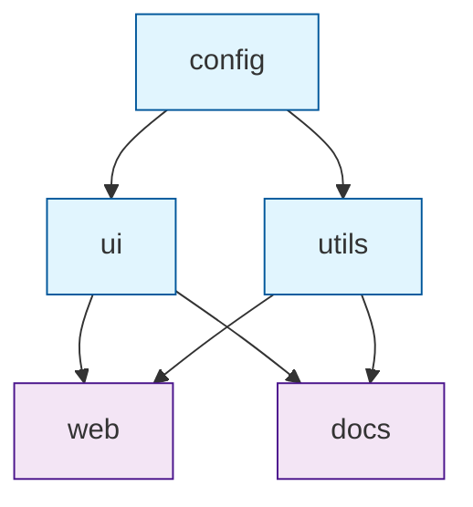

# Chapter 1: Getting Started with Turborepo

Welcome to Turborepo! If you've ever struggled with slow builds in large monorepos, you're in the right place. Turborepo is the high-performance build system that makes your monorepo feel as fast as a single package, using intelligent caching and parallel execution.

## What Makes Turborepo Special?

Turborepo revolutionizes monorepo development by:

- **Intelligent Caching** - Never rebuild unchanged code
- **Parallel Execution** - Run tasks simultaneously across packages
- **Smart Scheduling** - Only run tasks when dependencies change
- **Remote Caching** - Share build artifacts across your team
- **Zero Configuration** - Works out of the box with sensible defaults
- **Framework Agnostic** - Supports any JavaScript/TypeScript tool

## Installing Turborepo

### Creating Your First Monorepo

```bash
# Create a new Turborepo
npx create-turbo@latest my-monorepo
cd my-monorepo

# Or add to existing project
npm install turbo --save-dev

# Initialize Turborepo in existing monorepo
npx turbo init
```

### Basic Project Structure

```bash
my-monorepo/
├── packages/
│   ├── ui/           # Shared UI components
│   ├── utils/        # Shared utilities
│   └── config/       # Shared configuration
├── apps/
│   ├── web/          # Next.js application
│   └── docs/         # Documentation site
├── package.json
├── turbo.json        # Turborepo configuration
└── yarn.lock
```

## Your First Turborepo Pipeline

Let's create a simple monorepo with Turborepo:

```json
// package.json (root)
{
  "name": "my-monorepo",
  "private": true,
  "workspaces": [
    "apps/*",
    "packages/*"
  ],
  "scripts": {
    "build": "turbo run build",
    "dev": "turbo run dev",
    "lint": "turbo run lint"
  },
  "devDependencies": {
    "turbo": "^1.10.0"
  }
}
```

```json
// turbo.json
{
  "$schema": "https://turbo.build/schema.json",
  "globalDependencies": [
    "**/.env.*local"
  ],
  "tasks": {
    "build": {
      "dependsOn": ["^build"],
      "outputs": ["dist/**", ".next/**", "!.next/cache/**"]
    },
    "dev": {
      "cache": false,
      "persistent": true
    },
    "lint": {},
    "test": {
      "dependsOn": ["build"],
      "inputs": ["src/**/*.tsx", "src/**/*.ts", "test/**/*.ts", "test/**/*.tsx"]
    }
  }
}
```

## Understanding Turborepo Concepts

### Task Dependencies

```json
// turbo.json with dependencies
{
  "tasks": {
    "build": {
      "dependsOn": ["^build"],  // Wait for dependencies to build first
      "outputs": ["dist/**"]    // Cache these outputs
    },
    "test": {
      "dependsOn": ["build"],   // Must build before testing
      "inputs": ["src/**", "test/**"]  // Watch these files for changes
    },
    "lint": {
      "dependsOn": []           // No dependencies
    }
  }
}
```

### Package Structure

```json
// packages/ui/package.json
{
  "name": "@my-monorepo/ui",
  "version": "1.0.0",
  "main": "./dist/index.js",
  "types": "./dist/index.d.ts",
  "scripts": {
    "build": "tsup src/index.ts --format cjs,esm --dts",
    "dev": "tsup src/index.ts --format cjs,esm --dts --watch",
    "lint": "eslint src/**/*.ts",
    "test": "jest"
  },
  "dependencies": {
    "react": "^18.2.0"
  },
  "devDependencies": {
    "tsup": "^7.2.0",
    "typescript": "^5.2.0"
  }
}
```

```json
// apps/web/package.json
{
  "name": "@my-monorepo/web",
  "version": "1.0.0",
  "scripts": {
    "build": "next build",
    "dev": "next dev",
    "lint": "next lint",
    "start": "next start"
  },
  "dependencies": {
    "@my-monorepo/ui": "*",
    "next": "^14.0.0",
    "react": "^18.2.0",
    "react-dom": "^18.2.0"
  }
}
```

## Running Tasks

### Basic Commands

```bash
# Run build for all packages
turbo run build

# Run dev for specific packages
turbo run dev --filter=@my-monorepo/web

# Run tests with dependencies
turbo run test --filter=@my-monorepo/ui

# Run lint for all packages
turbo run lint

# Dry run to see what would execute
turbo run build --dry-run
```

### Filtering Packages

```bash
# Run only for specific package
turbo run build --filter=@my-monorepo/ui

# Run for package and its dependencies
turbo run build --filter=@my-monorepo/web

# Run for packages matching pattern
turbo run test --filter="./packages/*"

# Exclude specific packages
turbo run lint --filter="!@my-monorepo/docs"
```

## Caching in Action

### Understanding the Cache

```bash
# Check cache status
turbo run build --filter=@my-monorepo/ui

# Output shows:
# • Packages in scope: @my-monorepo/ui
# • Running build in 1 packages
# • Remote caching enabled

# Run again (should use cache)
turbo run build --filter=@my-monorepo/ui

# Output shows:
# • Packages in scope: @my-monorepo/ui
# • Running build in 1 packages
# • Remote cache hit: 100% (1/1)
```

### Cache Configuration

```json
// turbo.json with cache configuration
{
  "tasks": {
    "build": {
      "outputs": [
        "dist/**",
        ".next/**",
        "!.next/cache/**"
      ],
      "inputs": [
        "src/**",
        "package.json",
        "tsconfig.json"
      ]
    },
    "test": {
      "inputs": [
        "src/**/*.ts",
        "test/**/*.ts",
        "jest.config.js"
      ],
      "outputs": [
        "coverage/**"
      ]
    }
  }
}
```

## Pipeline Execution

### Task Scheduling

```bash
# Build entire monorepo
turbo run build

# Turborepo automatically:
# 1. Analyzes dependencies between packages
# 2. Schedules tasks in optimal order
# 3. Runs independent tasks in parallel
# 4. Caches outputs for future runs
# 5. Handles failures gracefully
```

### Execution Graph



## Error Handling and Debugging

### Debugging Pipeline Issues

```bash
# Get detailed execution information
turbo run build --log-order=stream

# See dependency graph
turbo run build --graph

# Debug specific package
turbo run build --filter=@my-monorepo/ui --log-level=debug

# Continue after failure
turbo run build --continue
```

### Common Issues

```bash
# Clear cache if issues occur
turbo run build --force

# Clear all caches
rm -rf node_modules/.cache/turbo

# Check for configuration issues
turbo run build --dry-run --log-level=debug
```

## Integration with Tools

### TypeScript Configuration

```json
// packages/ui/tsconfig.json
{
  "extends": "../../tsconfig.json",
  "compilerOptions": {
    "outDir": "./dist",
    "rootDir": "./src"
  },
  "include": ["src/**/*"],
  "exclude": ["dist", "node_modules"]
}
```

### ESLint Configuration

```json
// packages/ui/.eslintrc.js
module.exports = {
  extends: ['../../.eslintrc.js'],
  rules: {
    // Package-specific rules
  }
}
```

## What We've Accomplished

Congratulations! 🎉 You've successfully:

1. **Installed Turborepo** and created your first monorepo
2. **Configured workspaces** with proper package structure
3. **Set up task pipelines** with dependencies and caching
4. **Executed parallel builds** with intelligent scheduling
5. **Implemented caching** for faster subsequent builds
6. **Debugged pipeline issues** and handled errors
7. **Integrated with development tools** like TypeScript and ESLint

## Next Steps

Now that you understand Turborepo basics, let's explore workspace configuration in depth. In [Chapter 2: Workspace Configuration](02-workspace-configuration.md), we'll dive into advanced workspace setup, package management, and configuration patterns.

---

**Practice what you've learned:**
1. Create a monorepo with multiple packages
2. Set up build pipelines with dependencies
3. Experiment with different filtering options
4. Implement caching for your tasks
5. Debug and optimize your pipeline execution

*What's your biggest monorepo performance challenge?* ⚡
