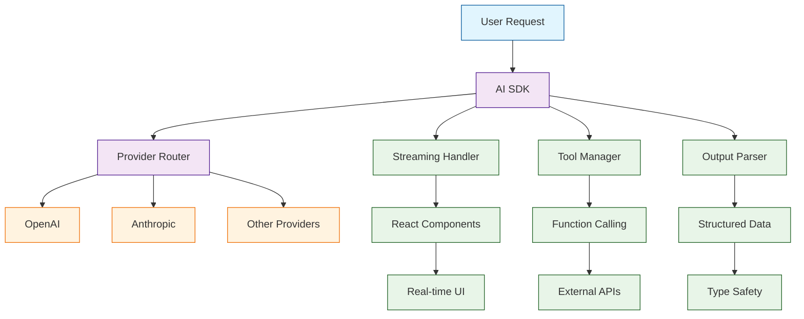

# Vercel AI Tutorial: Building AI-Powered Applications with TypeScript

> This tutorial is AI-generated! To learn more, check out [Awesome Code Docs](https://github.com/johnxie/awesome-code-docs)

Vercel AI[View Repo](https://github.com/vercel/ai) is the AI Toolkit for TypeScript created by the makers of Next.js. It provides a comprehensive, type-safe library for building AI-powered applications with streaming responses, function calling, and seamless integration with popular AI providers.

Vercel AI enables developers to build sophisticated AI applications with React/Next.js, featuring real-time streaming, structured outputs, tool calling, and production-ready patterns for modern web applications.

## Tutorial Chapters

Welcome to your journey through AI-powered TypeScript applications! This tutorial explores building modern AI applications with Vercel AI.

1. **[Chapter 1: Getting Started with Vercel AI](01-getting-started.md)** - Installation, setup, and your first AI application
2. **[Chapter 2: Text Generation](02-text-generation.md)** - Basic text generation with different providers
3. **[Chapter 3: Streaming Responses](03-streaming-responses.md)** - Real-time streaming for better UX
4. **[Chapter 4: Function Calling](04-function-calling.md)** - Tool integration and function calling
5. **[Chapter 5: Structured Outputs](05-structured-outputs.md)** - Type-safe structured data generation
6. **[Chapter 6: React Integration](06-react-integration.md)** - Building AI-powered React components
7. **[Chapter 7: Next.js Applications](07-nextjs-applications.md)** - Full-stack AI applications
8. **[Chapter 8: Production Deployment](08-production-deployment.md)** - Scaling and deploying AI applications

## What You'll Learn

By the end of this tutorial, you'll be able to:

- **Build AI Applications** - Create sophisticated AI-powered apps with TypeScript
- **Handle Streaming** - Implement real-time AI responses for better user experience
- **Integrate Tools** - Connect external APIs and functions to AI models
- **Ensure Type Safety** - Use TypeScript for type-safe AI interactions
- **Create React Components** - Build interactive AI-powered UI components
- **Deploy at Scale** - Production-ready AI applications on Vercel
- **Handle Multiple Providers** - Work with OpenAI, Anthropic, and other AI providers
- **Implement Error Handling** - Robust error handling and fallback strategies

## Prerequisites

- Node.js 18+
- TypeScript basics
- React/Next.js fundamentals (for later chapters)
- Understanding of async/await patterns

## Learning Path

### 🟢 Beginner Track
Perfect for developers new to AI application development:
1. Chapters 1-2: Setup and basic AI integration
2. Focus on understanding Vercel AI fundamentals

### 🟡 Intermediate Track
For developers building AI-powered applications:
1. Chapters 3-5: Streaming, tools, and structured outputs
2. Learn advanced AI integration patterns

### 🔴 Advanced Track
For production AI application development:
1. Chapters 6-8: React integration, full-stack apps, and deployment
2. Master enterprise-grade AI applications

---

**Ready to build AI applications with Vercel AI? Let's begin with [Chapter 1: Getting Started](01-getting-started.md)!**

*Generated by [AI Codebase Knowledge Builder](https://github.com/The-Pocket/Tutorial-Codebase-Knowledge)*
