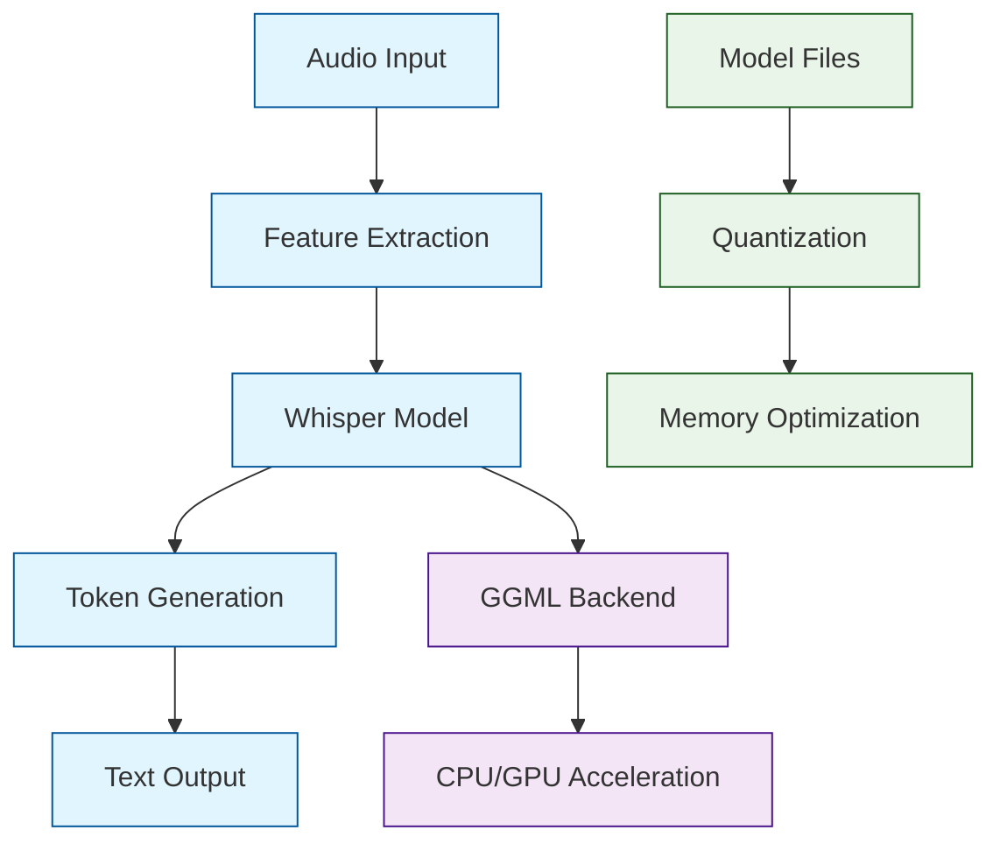

# Whisper.cpp Tutorial: High-Performance Speech Recognition in C/C++

> This tutorial is AI-generated! To learn more, check out [Awesome Code Docs](https://github.com/johnxie/awesome-code-docs)

Whisper.cpp[View Repo](https://github.com/ggml-org/whisper.cpp) is a complete C/C++ port of OpenAI's Whisper automatic speech recognition (ASR) model. What makes it special is its focus on high performance, low resource usage, and the ability to run on edge devices without requiring a GPU or internet connection.

Imagine building a voice assistant that can run on a Raspberry Pi, or adding speech recognition to an embedded system. Whisper.cpp makes this possible by running the Whisper model entirely on CPU with minimal memory requirements.

## Tutorial Chapters

Welcome to your journey through Whisper.cpp! This tutorial takes you from basic audio processing to building complete speech recognition applications.

1. **[Chapter 1: Getting Started with Whisper.cpp](01-getting-started.md)** - Installation, basic setup, and your first transcription
2. **[Chapter 2: Audio Processing Fundamentals](02-audio-processing.md)** - Understanding audio formats, sampling, and preprocessing
3. **[Chapter 3: Model Architecture & GGML](03-model-architecture.md)** - How Whisper works and the GGML tensor library
4. **[Chapter 4: Core API & Usage Patterns](04-core-api.md)** - Main API functions and common usage patterns
5. **[Chapter 5: Performance Optimization](05-performance-optimization.md)** - Memory usage, quantization, and speed improvements
6. **[Chapter 6: Custom Applications](06-custom-applications.md)** - Building real-world applications and integrations
7. **[Chapter 7: Advanced Features](07-advanced-features.md)** - Multi-language support, streaming, and custom models
8. **[Chapter 8: Deployment & Production](08-deployment-production.md)** - Cross-platform deployment and production considerations

## What You'll Learn

By the end of this tutorial, you'll be able to:

- **Transcribe audio** in multiple languages with high accuracy
- **Optimize models** for different hardware constraints
- **Build custom applications** using Whisper.cpp's C/C++ API
- **Deploy to edge devices** like Raspberry Pi and mobile devices
- **Process streaming audio** in real-time applications
- **Integrate with existing systems** using various programming languages
- **Fine-tune performance** through quantization and optimization techniques

## Prerequisites

- Basic C/C++ programming knowledge
- Understanding of audio concepts (helpful but not required)
- Command-line experience
- Familiarity with build systems (Make, CMake)

## Learning Path

### 🟢 Beginner Track
Perfect for developers new to audio processing and C++:
1. Chapters 1-2: Installation and basic audio concepts
2. Focus on understanding the core functionality

### 🟡 Intermediate Track
For developers ready to build applications:
1. Chapters 3-5: Architecture, API usage, and optimization
2. Learn to integrate Whisper.cpp into your projects

### 🔴 Advanced Track
For high-performance and production deployments:
1. Chapters 6-8: Custom applications, advanced features, and deployment
2. Master production-level implementations

---

**Ready to start building speech recognition applications? Let's begin with [Chapter 1: Getting Started](01-getting-started.md)!**

*Generated by [AI Codebase Knowledge Builder](https://github.com/The-Pocket/Tutorial-Codebase-Knowledge)*
